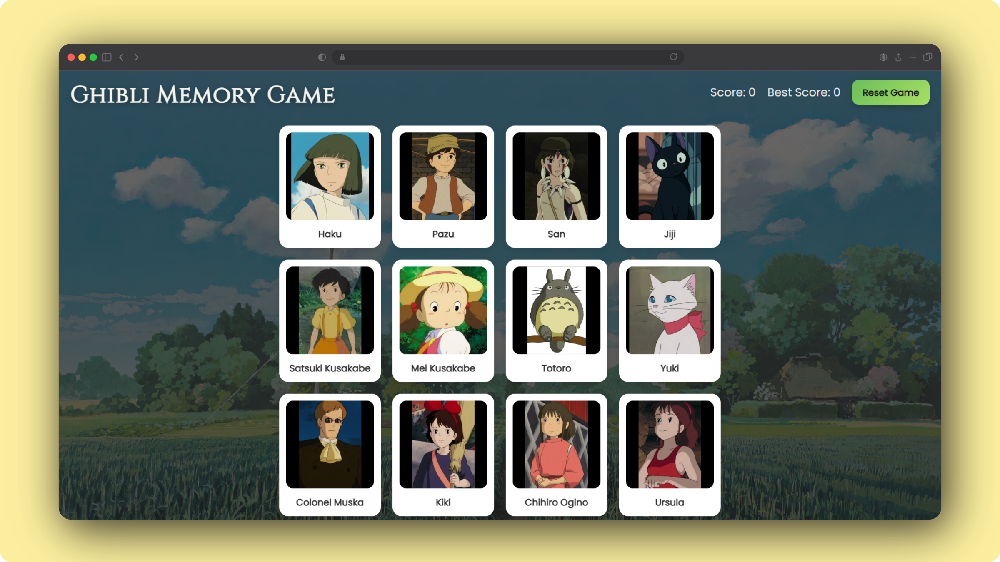

# Memory Game

A memory card game built using React where players must click each card only once.  
If a card is clicked twice, the game resets. The goal is to achieve the highest score possible.

# Live Demo

[Play Here](https://memory-card-game-taupe-ten.vercel.app/)

# Screenshot

# Tech Stack

- React (useState, useEffect)
- JavaScript (ES6+)
- CSS (Grid, Flexbox, Animations)
- HTML5
- Studio Ghibli API

# Features

- Memory card gameplay (no duplicate clicks allowed)
- Score and best score tracking
- Cards shuffle after every click
- Responsive design for mobile and desktop
- Smooth animations and transitions
- Ghibli-themed character data

# How to Play

1. Click on any card
2. Do not click the same card twice
3. Each correct click increases your score
4. Cards shuffle after every click
5. Clicking a repeated card resets the game
6. Try to beat your best score

# API Used

Studio Ghibli API  
https://ghibliapi.dev

Used to fetch character data for the game.
